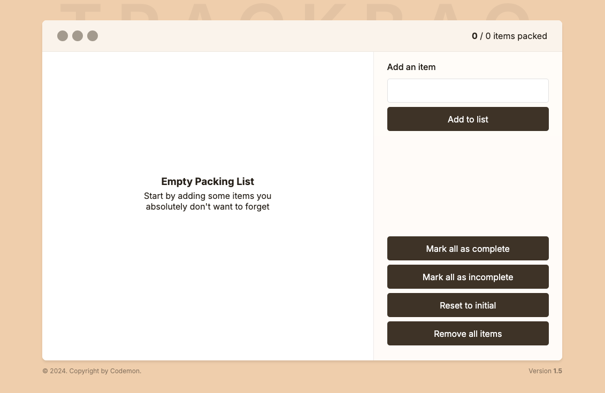
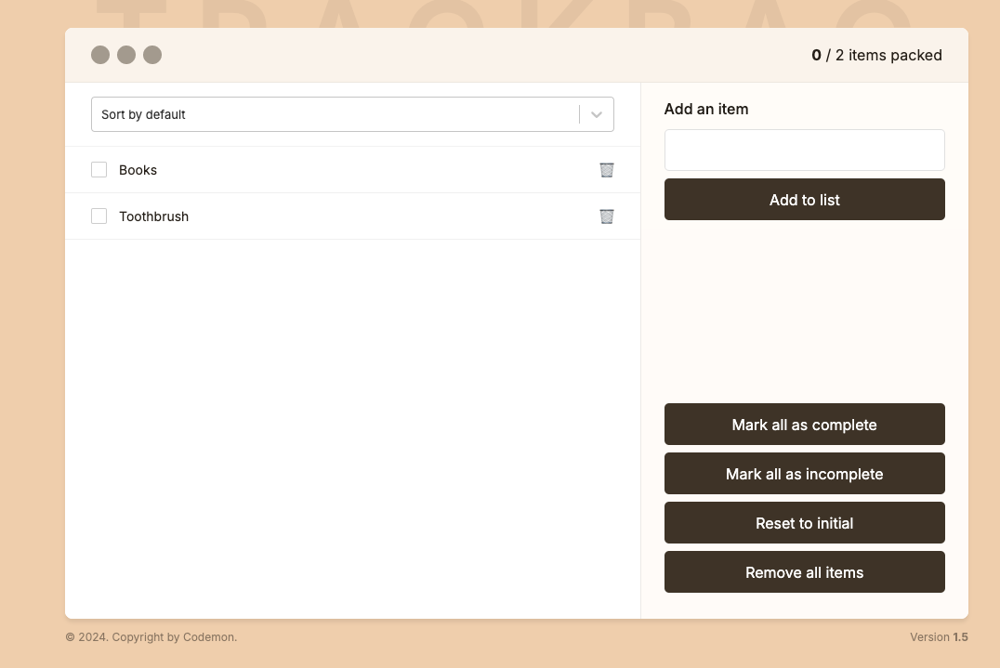
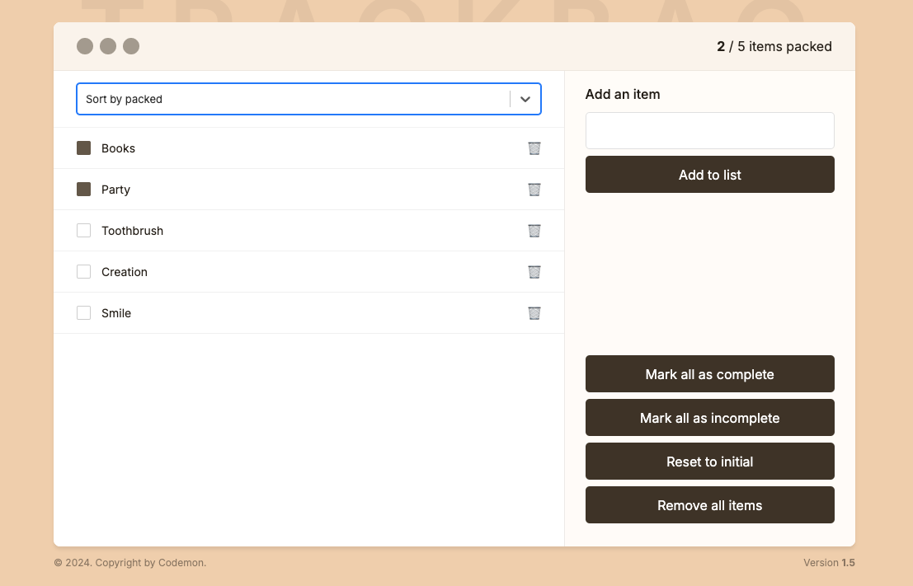

# TrackBag

Trackbag is a simple, intuitive web application designed to help users manage their tasks efficiently. Built with React and Vite, it allows users to add tasks, mark them as complete or incomplete, remove all tasks, or reset the list to its initial state. The app also persists data using LocalStorage, ensuring that task lists remain available even after refreshing or closing the browser. State management is handled with Zustand for a smooth and predictable user experience.

## Table of Contents

- [Story Behind the Project](#story-behind-the-project)
- [Features](#features)
- [Demo](#demo)
- [Usage](#usage)
- [Technologies Used](#technologies-used)
- [Project Structure](#project-structure)

## Story Behind the Project

### The Problem

Task management is a fundamental part of daily life.
From professionals to students, everyone requires an efficient way to organize their tasks.
However, many task management apps can be overwhelming with too many features or can clutter the user interface,
making it harder to focus on the tasks at hand.

### The Solution

Trackbag was created to provide a minimalistic yet powerful task management solution.
It allows users to perform essential actions such as adding tasks, marking them complete, resetting lists,
and removing all tasks with ease.
With a clean and intuitive interface, users can focus on their tasks without unnecessary distractions.

By utilizing LocalStorage,
the app ensures that users do not lose their data after refreshing the page or closing the browser.
Zustand was chosen for state management
to make the application easy to scale while maintaining predictable state changes.

## Features

- **Add Items to the List**: Users can easily add new tasks to their to-do list.
- **Mark All as Complete/Incomplete**: Quickly mark all tasks as either completed or incomplete.
- **Reset to Initial State**: Reset the list to its initial state.
- **Remove All Items**: Clear the list with a single action.
- **Empty Screen State**: When there are no tasks, an empty screen is shown to guide the user.
- **Filter items**: User can filter items based on packed and unpacked selection
- **LocalStorage Persistence**: All data is persisted using LocalStorage, ensuring tasks are saved across sessions.
- **Zustand State Management**: All state management is handled by Zustand for predictable and scalable state handling.

## Demo

A live demo of the application is available at: [Trackbag Demo Link](https://trackbag-web-application.vercel.app/)




## Usage

1. Open the app in your browser.
2. Add new tasks to the list using the input field.
3. Mark individual tasks as complete by clicking on them, or mark all tasks as complete using the "Mark All Complete" button.
4. You can toggle between marking tasks as complete and incomplete or reset the list to its initial state.
5. If you'd like to start fresh, use the "Remove All" button to clear all tasks.
6. When no tasks are available, an empty state screen will guide the user to add new tasks.

## Technologies Used

**Frontend:**
- React
- Vite
- Zustand for state management
- CSS for styling

**Development Tools:**
- JavaScript (ES6+)
- Node.js
- npm

## Project Structure
```bash
trackbag/
├── public/             # Static assets/not necessary
├── src/
│   ├── components/     # React or Vue components
│   ├── App.jsx         # Main app component for React
│   ├── index.css       # Global styles
│   ├── main.jsx        # Entry point for React
├── .gitignore          # Git ignore file
├── package.json        # Project metadata and scripts
└── vite.config.js      # Vite configuration
```
